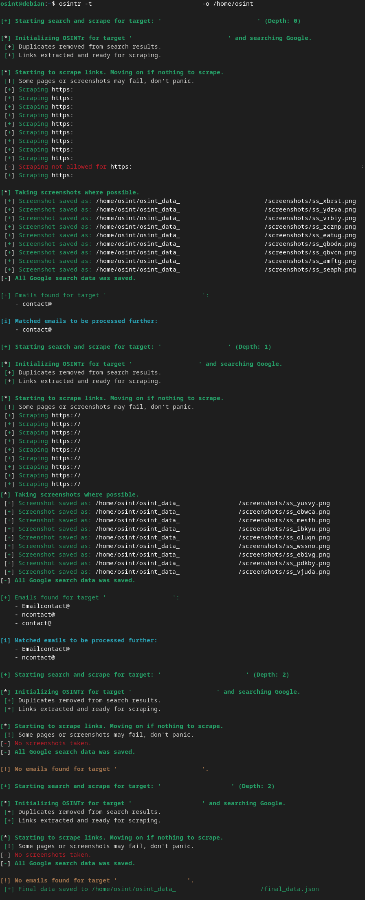

# OSINTr
**[OFM](https://github.com/0SINTr/ofm) Stage 1 tool for GRASS (Google Recursive Advanced Search & Scrape)**

[](https://raw.githubusercontent.com/0SINTr/osintr/master/LICENSE)
[](https://www.python.org)
[](https://github.com/0SINTr/osintr/releases/tag/v0.2.0)
[](https://github.com/0SINTr/osintr/commits/main)

**OSINTr** helps you build a strong foundation for any OSINT investigation by quickly creating a **digital footprint** of the target via recursive advanced Google searches via **SerperDev** and **Firecrawl** APIs.

## Why OSINTr?

**OSINTr** directly interacts only with high-quality APIs (SerpDev, Firecrawl) at a low cost, bypassing the need for unreliable third-party apps and implicitly **handling common issues** related to parsing, captchas, proxies or other types of usual setbacks. This ensures full control over the code and exclusive focus on the OSINT tasks rather than troubleshooting scraping and crawling hiccups.

## Workflow

**OSINTr** works best on Linux and tackles **Stage 1 of the [OFM](https://github.com/0SINTr/ofm)** workflow by performing **GRASS** (Google Recursive Advanced Search & Scrape).

### Data Collection

- Requires a **target** for the OSINT investigation (see **Usage** below).   
- Ensure you add your API keys (see **API Keys** below) before running the tool.

**Automated tasks include:**
- Performs **verbatim** (intitle, intext, inanchor included) and **inurl** Google search.
- Scrapes all found URLs and extracts all **email addresses** and **URLs** from each page.
- Saves a **full page screenshot** (if possible) of each page in a separate directory.
- For each email address it finds, it **recursively** performs **GRASS** for each address.
- Automatically checks for matches between potentially related email addresses, using:
    - Exact matching:
        - `**john.doe@tests.com**` to `**john.doe@test.com**`
    - Case-insensitive matching:
        - **JoHn.DoE@test.com** to **john.doe@test.com**
    - Handling dots and plus-addressing:
        - **john.doe+dev@test.com** to **john.doe@test.com**
    - Characters to digits mapping & leet:
        - **j0hnd03@example.com** to **john.doe@test.com**
    - Levenshtein fuzzy matching (thr=2):
        - **johnny.doe@test.com** to **john.doe@test.com**
    - Homoglyph matching:
        - **john.doｅ@test.com** to **john.doe@test.com**
    - Phonetic matching:
        - **john.dough@test.com** to **john.doe@test.com**
    - Substring matching:
        - **john.doe@test.com** to **john.doe99@test.com**

- Currently, the **maximum depth for recursion** is set to 2. May increase in the future.
- Creates a directory under **-o OUTPUT** directory named *osint_TargetName* for each target.
- Saves all email addresses and URLs from the **GRASS** process to a file **final_data.json**.

## API Keys

Running **OSINTr** requires API keys for the benefits stated previously. The API keys should reside in your environment **prior** to running **OSINTr**.

**To add the API keys to your environment, edit bashrc or zshrc.**
```plaintext
vim ~/.bashrc
export SERPER_API_KEY="<your_key_here>"
export FIRECRAWL_API_KEY="<your_key_here>"
source ~/.bashrc
```

**Getting API Keys:**

- **SerperDev**: [Get your key here](https://serper.dev/)
- **Firecrawl**: [Get your key here](https://www.firecrawl.dev/)

## Costs

**OSINTr** aims to use reliable, but affordable APIs:

- **SerperDev**: 2,500 free queries, then pay-as-you-go (50k queries for $50).
- **Firecrawl**: 500 free credits; $19/mo for 3,000 page scrapes. 

## Installation

**Preparing**
- Ensure **Python >=3.10** is installed.
- Add `/home/<user>/.local/bin` to `PATH`.
- Edit `~/.zshrc` if that's your default.

```bash
sudo apt upgrade python3
sudo apt upgrade python3-pip
vim ~/.bashrc
export PATH="$HOME/.local/bin:$PATH"
source ~/.bashrc
```

**Installing**
```bash
pipx install git+https://github.com/0SINTr/osintr.git
```

## Usage

```console
$ osintr -h
usage: main.py [-h] -t TARGET -o OUTPUT

examples:
osintr -t jdoe95@example.com -o /home/bob/data
osintr -t john.doe95 -o /home/bob/data
osintr -t "John Doe" -o /home/bob/data
osintr -t "Evil Corp Ltd" -o /home/bob/data

options:
  -h, --help  show this help message and exit
  -t TARGET   Target of investigation
  -o OUTPUT   Directory to save results

NOTE!
For person or company names use double quotes to enclose the whole name.
```

## Screenshot

See an example workflow below. Details related to the target have been **hidden** for obvious reasons.



## Planned Upgrades

- [ ] Filtering crawled URLs by relevance.
- [ ] Better formating for the JSON data.

## Disclaimer

- **OSINTr** is designed for **passive**, **non-intrusive** OSINT tasks.
- Any illegal or unethical use of the tool is **your** responsibility.
- See **LICENSE** for more details on rights, permissions, and liability.

## Support

**API documentation**:

- [SerperDev API docs](https://serper.dev/)
- [Firecrawl API docs](https://docs.firecrawl.dev/introduction)