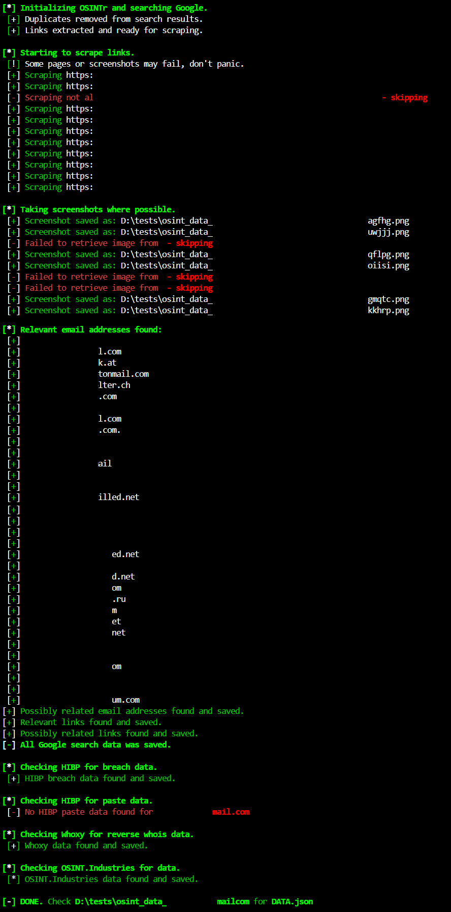

# OSINTr

[](https://raw.githubusercontent.com/0SINTr/osintr/master/LICENSE)
[](https://www.python.org)
[](https://github.com/0SINTr/osintr/releases/tag/v0.1.0)
[](https://github.com/0SINTr/osintr/commits/main)

**OSINTr** helps you build a strong foundation for any OSINT investigation by quickly creating a digital footprint of the target via advanced Google searches, HIBP breach and paste data, Whoxy reverse whois data, OSINT Industries API data etc.

## Why OSINTr?

**OSINTr** directly interacts only with high-quality APIs (SerpDev, Firecrawl, HIBP, Whoxy, OSINT Industries) at a low cost, bypassing the need for unreliable third-party apps. This ensures you have full control over the code and only need to cover the API costs.

## Workflow

**OSINTr** works on Linux and performs two primary tasks:

### 1. Data Collection

You provide the **target** of the OSINT investigation (see **Usage** below).   
Ensure you add your API keys (see **API Keys** below) before running the tool.

**Automated tasks include:**
- Performs verbatim, intext, inurl and intitle search on Google.
- Scrapes all URLs and saves all links and email addresses from each page.
- Saves a full page screenshot of each page in a separate directory.
- Sorts email addresses and links based on relevance. Saves to `DATA.json`.
- Checks HIBP breaches and pastes (for **-e**|**-u**). Saves to `DATA.json`.
- Checks Whoxy reverse whois data (for **-e**|**-u**|**-n**|**-c**). Saves to `DATA.json`.
- Checks OSINT.Industries for more data (for **-e**|**-u**|**-p**). Saves to `DATA.json`.

### 2. Data Analysis (planned upgrade)

Once data is collected, **OSINTr** will automatically analyze the information inside `DATA.json` for patterns and hidden connections between data points.

**Automated tasks include:**
- Analyzes `DATA.json` for patterns and insights using OpenAI [GPT-o1](https://openai.com/o1/).
- **OSINTr** builds a profile or digital footprint of the target based on collected data.
- The gathered data is carefully curated and a summary is provided in **.md** format.

## API Keys

Running the **Data Collection** and **Data Analysis** phases requires API keys.\
The API keys should reside in your environment prior to running **OSINTr**.

**To add the API keys to your environment, edit bashrc or zshrc.**
```plaintext
vim ~/.zshrc
export SERPER_API_KEY="<your_key_here>"
export FIRECRAWL_API_KEY="<your_key_here>"
export HIBP_API_KEY="<your_key_here>"
export WHOXY_API_KEY="<your_key_here>"
export OSIND_API_KEY="<your_key_here>"
export OPENAI_API_KEY="<your_key_here>"
source ~/.zshrc
```

**Note!** The **OPENAI_API_KEY** is currently optional until the **Data Analysis** functionality is implemented.

**API Keys:**

- **SerperDev**: [Get your key here](https://serper.dev/)
- **Firecrawl**: [Get your key here](https://www.firecrawl.dev/)
- **HaveIBeenPwned**: [Get your key here](https://haveibeenpwned.com/)
- **Whoxy**: [Get your key here](https://www.whoxy.com/)
- **OSINT.Industries**: [Get your key here](https://www.osint.industries/)
- **OpenAI**: [Get your key here](https://openai.com/)

**Note!** For Whoxy make sure you buy credits for the [Reverse Whois API](https://www.whoxy.com/pricing.php).

## Costs

**OSINTr** aims to use reliable, but affordable APIs:

- **SerperDev**: 2,500 free queries, then pay-as-you-go (50k queries for $50).
- **Firecrawl**: 500 free credits; $19/mo for 3,000 page scrapes. 
- **HIBP**: Pwned1 plan for $3.95/mo, 10 email searches/minute.
- **Whoxy**: $10 for 1,000 reverse whois API queries.
- **OSINT.Industries** (optional): Starting at £19/mo.
- **OpenAI**: Pay-as-you-go.

## Installation

**Preparing**\
Ensure Python >=3.10 is installed.\
Add `/home/<user>/.local/bin` to `PATH`.\
Edit `~/.bashrc` if that's your default.

```bash
sudo apt upgrade python3
sudo apt upgrade python3-pip
vim ~/.zshrc
export PATH="$HOME/.local/bin:$PATH"
source ~/.zshrc
```

**Installing**
```bash
git clone https://github.com/0SINTr/osintr.git
cd osintr
python -m pip install .
```

## Usage

```console
$ osintr -h
usage: osintr [-h] (-e EMAIL | -u USER | -p PHONE | -n NAME | -c COMPANY) -o OUTPUT

See below all available arguments for osintr.
Use only one -e|-u|-p|-n|-c argument at a time.

example:
osintr -e example@example.com -o /home/bob/data

options:
  -h, --help  show this help message and exit
  -e EMAIL    Target email address
  -u USER     Target username
  -p PHONE    Target phone number
  -n NAME     Target person name
  -c COMPANY  Target company name
  -o OUTPUT   Directory to save results

NOTE!
For person or company name use double quotes to enclose the whole name.
```

## Screenshot



## Upgrading

To upgrade **OSINTr** to the latest version, follow these steps:

```bash
cd osintr
git pull origin main
python -m pip install --upgrade osintr
```

## Planned Upgrades

- Better formating for the JSON data (md or html).

## Disclaimer

- **OSINTr** is designed for passive, non-intrusive OSINT tasks.
- Any illegal or unethical use of the tool is **your** responsibility.
- See **LICENSE** for more details on rights, permissions, and liability.

## Support

API documentation:

- [SerperDev API docs](https://serper.dev/)
- [Firecrawl API docs](https://docs.firecrawl.dev/introduction)
- [HaveIBeenPwned API docs](https://haveibeenpwned.com/API/v3)
- [Whoxy Reverse API docs](https://www.whoxy.com/reverse-whois/)
- [OSINT.Industries API docs](https://docs.osint.industries/reference/search)
- [OpenAI API docs](https://platform.openai.com/docs/overview)