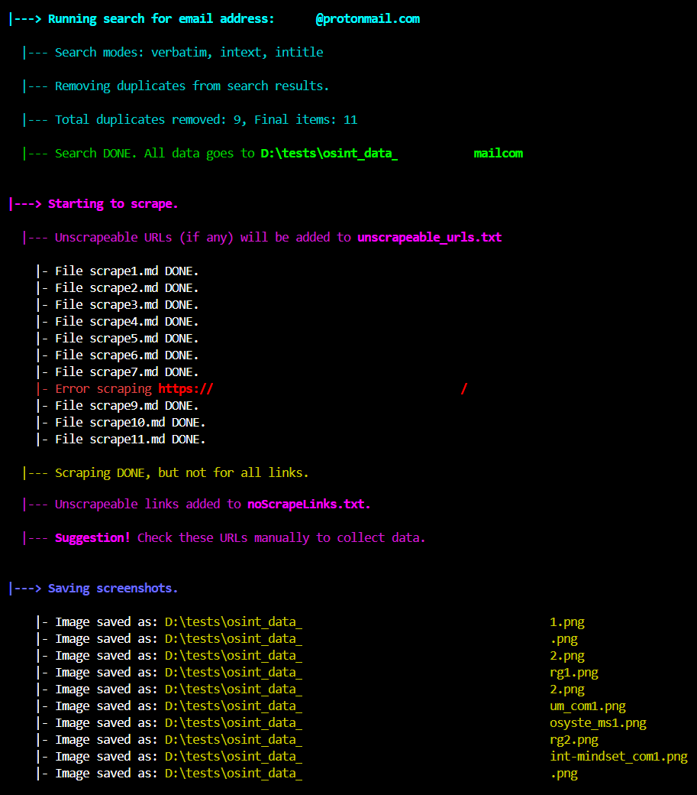
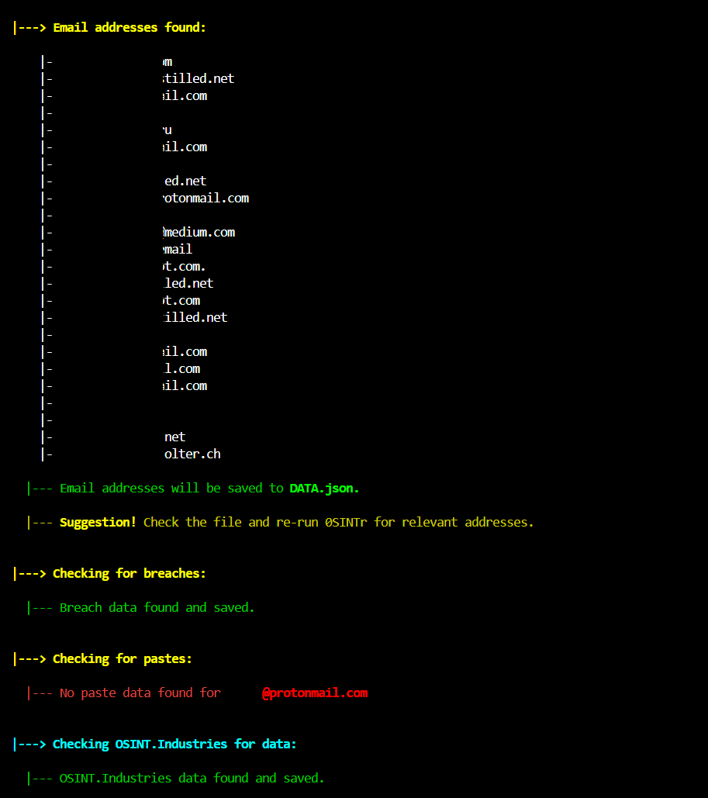

# 0SINTr

Welcome to the **0SINTr** project! This tool helps you build a strong foundation for any OSINT investigation by quickly creating a digital footprint of the target via advanced Google searches, HIBP breach and paste data, and other optional data sources.

---

## Why 0SINTr?

The app directly interacts with high-quality APIs (SerpDev, Firecrawl, HIBP) at a low cost, bypassing the need for unreliable third-party apps. This ensures you have full control over the code and only need to cover the API costs.

---

## Workflow

0SINTr performs two primary tasks:

### 1. Data Collection

You provide a **Username** or **Email Address** for the **-t** argument (see below). This is the **target** of the OSINT investigation. Ensure you create and populate a `.env` file as described below before running the tool.

**Automated tasks include:**
- Perform verbatim search, intext, inurl, and intitle search on Google.
- Store search results, including URLs, as JSON and remove duplicates.
- Scrape all URLs and save each page as Markdown file in the `raw` directory.
- Save URLs of unscraped pages (e.g., social media) in a `.txt` file.
- Save full page screenshots of each page in the `raw` directory.
- Extract all the links and email addresses from the scraped pages.
- Sort the email addresses and URLs based on relevance and save to DATA.json.
- Check HIBP breaches and pastes for target and save to DATA.json.
- Optionally use the OSINT.Industries if an API key is provided. Save to DATA.json.

### 2. Data Analysis (planned upgrade)

Once data is collected, the AI functionality automatically analyzes the information inside DATA.json for patterns, hidden links and connections between data points.

**Automated tasks include:**
- Analyze data inside DATA.json for patterns and insights.
- Default AI model is [GPT-4o](https://platform.openai.com/docs/models/gpt-4o).
- 0SINTr builds a profile or digital footprint of the target based on collected data.
- The gathered data is carefully curated and a summary is provided in .md format.

---

## API Keys

Running the **Data Collection** and **Data Analysis** phases requires API keys inside the `.env` file.

**To use 0SINTr with GPT-4o, you need the following items in your `.env` file inside the root folder of 0SINTr.**
```plaintext
OPENAI_API_KEY=<your_key_here>
SERPER_API_KEY=<your_key_here>
FIRECRAWL_API_KEY=<your_key_here>
HIBP_API_KEY=<your_key_here>
``` 

**API Keys:**
- **OpenAI**: [Get your key here](https://openai.com/)
- **SerperDev**: [Get your key here](https://serper.dev/)
- **Firecrawl**: [Get your key here](https://www.firecrawl.dev/)
- **HaveIBeenPwned**: [Get your key here](https://haveibeenpwned.com/)

---

## Optional Feature

Optionally, you can collect data from **OSINT.Industries** via their API. Add the key in `.env` as `OSIND_API_KEY=<your_key_here>`. This functionality is triggered at runtime if you have a valid key saved in `.env`.

---

## Costs

- **OpenAI**: Pay-as-you-go.
- **SerperDev**: 2,500 free queries, then pay-as-you-go (50k queries for $50).
- **Firecrawl**: 500 free credits; $19/mo for 3,000 page scrapes. 
- **HIBP**: Pwned1 plan for $3.95/mo, 10 email searches/minute.
- **OSINT.Industries** (optional): Starting at £19/mo.

---

## Installation

Ensure Python >=3.10 is installed.

```bash
git clone https://github.com/0SINTr/0SINTr.git
cd 0SINTr
python setup.py install
```

---

## Usage

```bash
0sintr [-h] -t TARGET -o OUTPUT
```

---

## Upgrading

To update this tool to the latest version, follow these steps:

```bash
cd 0SINTr
git pull origin main
python setup.py install
```

---

## Screenshots





---

## Planned Upgrades

- More data sources from quality API providers
- Phone number and company search capabilities
- Recursive web scraping for deeper analysis

---

## Disclaimer

This tool is designed for passive, non-intrusive OSINT tasks. Any illegal or unethical use of the tool is your responsibility. See LICENSE for more details on rights, permissions, and liability.

---

## Support

For support, questions, or feedback:

- [OpenAI API docs](https://platform.openai.com/docs/overview)
- [SerperDev API docs](https://serper.dev/)
- [Firecrawl API docs](https://docs.firecrawl.dev/introduction)
- [HaveIBeenPwned API docs](https://haveibeenpwned.com/API/v3)
- [OSINT.Industries API docs](https://docs.osint.industries/reference/search)
